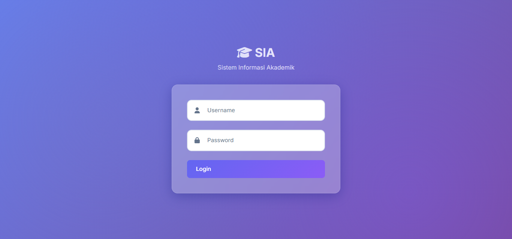
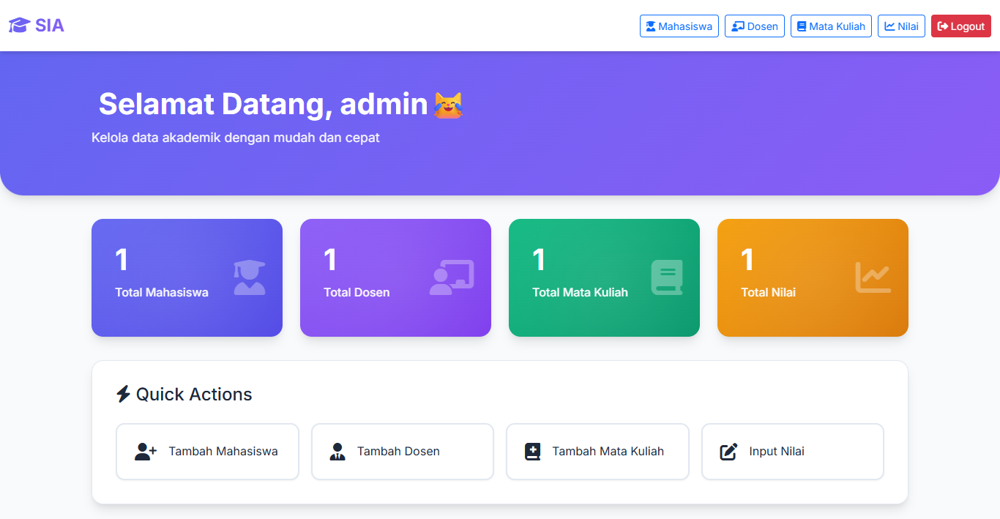
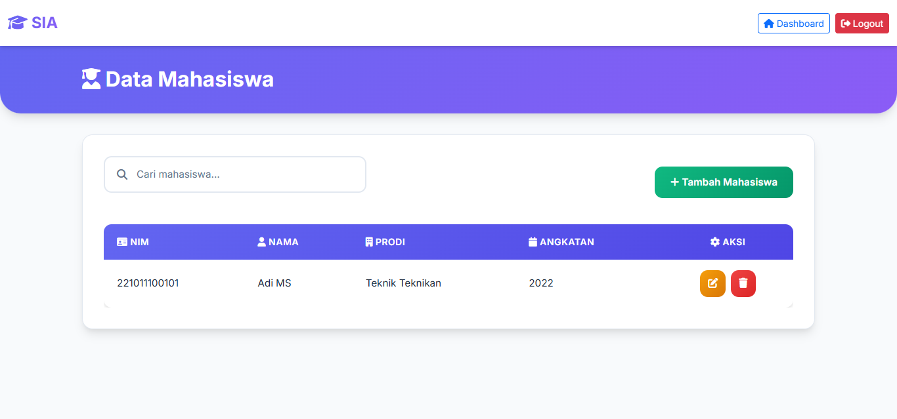

# SIA - Sistem Informasi Akademik


Sistem Informasi Akademik (SIA) adalah aplikasi web untuk mengelola data akademik universitas, termasuk data mahasiswa, dosen, mata kuliah, dan nilai.

## ✨ Features

-  **Modern UI/UX** 
-  **Manajemen Mahasiswa** 
-  **Manajemen Dosen** 
-  **Manajemen Mata Kuliah** 
-  **Manajemen Nilai** 
-  **Real-time Search** 
-  **Secure** 
-  **Responsive** 
-  **Fast** 

## 🚀 Tech Stack

- **Backend**: PHP 7.4+
- **Database**: MySQL/MariaDB
- **Frontend**: HTML5, CSS3, JavaScript
- **Framework CSS**: Bootstrap 5.3.0
- **Icons**: Font Awesome 6.4.0
- **Font**: Google Fonts (Inter)

##  Prerequisites

- XAMPP / WAMP / LAMP (PHP 7.4+ dan MySQL)
- Web Browser (Chrome, Firefox, Edge, Safari)
- Git (untuk clone repository)

##  Installation

### 1. Clone Repository

```bash
git clone https://github.com/KPPOKE/SIMPLE-N-FAST-SYSTEM-INFORMATION-ACADEMIC.git
cd project-SIA-univ-ytta
```

### 2. Setup Database

1. Buka phpMyAdmin (http://localhost/phpmyadmin)
2. Buat database baru dengan nama `pertemuan_9`
3. Import file SQL (jika ada) atau buat tabel manual:

```sql
CREATE DATABASE pertemuan_9;
USE pertemuan_9;

-- Tabel User
CREATE TABLE user (
    id INT AUTO_INCREMENT PRIMARY KEY,
    username VARCHAR(50) NOT NULL UNIQUE,
    password VARCHAR(255) NOT NULL,
    level VARCHAR(20) NOT NULL
);

-- Tabel Mahasiswa
CREATE TABLE mahasiswa (
    nim VARCHAR(20) PRIMARY KEY,
    nama VARCHAR(100) NOT NULL,
    prodi VARCHAR(100) NOT NULL,
    angkatan INT NOT NULL
);

-- Tabel Dosen
CREATE TABLE dosen (
    nidn VARCHAR(20) PRIMARY KEY,
    nama VARCHAR(100) NOT NULL
);

-- Tabel Mata Kuliah
CREATE TABLE matkul (
    kode_matkul VARCHAR(20) PRIMARY KEY,
    nama_matkul VARCHAR(100) NOT NULL,
    sks INT NOT NULL
);

-- Tabel Nilai
CREATE TABLE nilai (
    id INT AUTO_INCREMENT PRIMARY KEY,
    nim VARCHAR(20) NOT NULL,
    kode_matkul VARCHAR(20) NOT NULL,
    nilai DECIMAL(5,2) NOT NULL,
    FOREIGN KEY (nim) REFERENCES mahasiswa(nim),
    FOREIGN KEY (kode_matkul) REFERENCES matkul(kode_matkul)
);
```

### 3. Konfigurasi Database

Edit file `koneksi.php`:

```php
<?php
$koneksi = mysqli_connect("localhost", "root", "", "pertemuan_9");

if (!$koneksi) {
    die("Koneksi gagal: " . mysqli_connect_error());
}
?>
```

### 4. Generate Password Hash

Akses `generate_hash.php` untuk membuat password hash:

```
http://localhost/project%20SIA%20univ%20ytta/generate_hash.php
```

Copy hash yang dihasilkan dan insert ke tabel user:

```sql
INSERT INTO user (username, password, level) 
VALUES ('admin', 'PASTE_HASH_HERE', 'admin');
```

### 5. Akses Aplikasi

Buka browser dan akses:

```
http://localhost/project%20SIA%20univ%20ytta/
```

**Default Login:**
- Username: `admin`
- Password: `123456` (atau sesuai yang Anda set)


##  Features Detail

### Dashboard
- Statistik total mahasiswa, dosen, mata kuliah, dan nilai
- Quick action buttons
- Modern gradient cards dengan animasi

### Data Mahasiswa
- Tambah, edit, hapus mahasiswa
- Search real-time
- Cascade delete (hapus nilai terkait otomatis)

### Data Dosen
- Tambah, edit, hapus dosen
- Search real-time
- Prevent delete jika ada nilai terkait

### Data Mata Kuliah
- Tambah, edit, hapus mata kuliah
- Badge SKS dengan gradient
- Cascade delete (hapus nilai terkait otomatis)

### Data Nilai
- Tambah, edit, hapus nilai
- Grade otomatis (A: 80-100, B: 70-79, C: 60-69, D: 50-59, E: <50)
- Color-coded badges untuk grade
- JOIN query untuk menampilkan nama mahasiswa dan mata kuliah

##  Security Features

- ✅ Prepared Statements untuk semua query
- ✅ HTML Escaping untuk output
- ✅ URL Encoding untuk links
- ✅ Session Management
- ✅ Password Hashing (bcrypt)
- ✅ CSRF Protection (via session)

##  Browser Support

- ✅ Chrome (Latest)
- ✅ Firefox (Latest)
- ✅ Edge (Latest)
- ✅ Safari (Latest)

## 📝 License

This project is open source and available under the [MIT License](LICENSE).

##  Author

**KPPOKE**
- GitHub: [@KPPOKE](https://github.com/KPPOKE)

##  Contributing

Contributions, issues, and feature requests are welcome!

1. Fork the project
2. Create your feature branch (`git checkout -b feature/AmazingFeature`)
3. Commit your changes (`git commit -m 'Add some AmazingFeature'`)
4. Push to the branch (`git push origin feature/AmazingFeature`)
5. Open a Pull Request

##  Screenshots

### Login Page


### Dashboard


### Data Mahasiswa


### Data Nilai


## 🙏 Acknowledgments

- Bootstrap Team
- Font Awesome
- Google Fonts
- XAMPP Team

---

⭐ Star this repository if you find it helpful!
